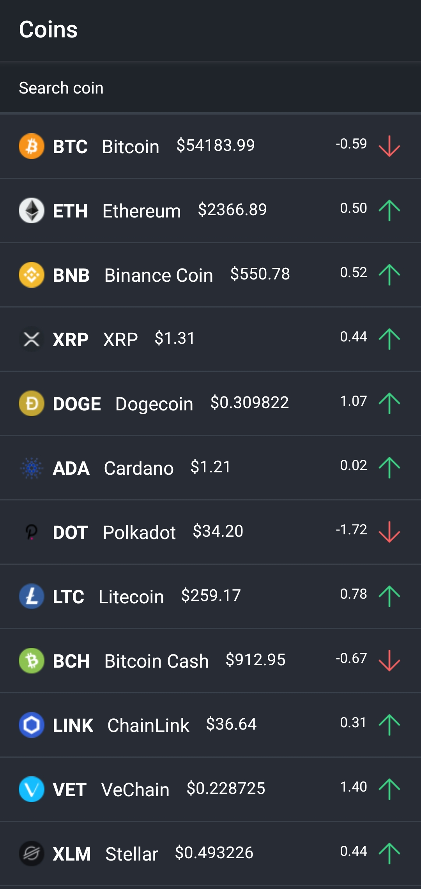
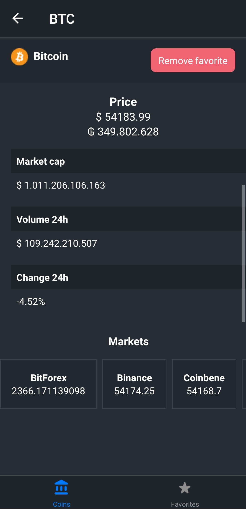
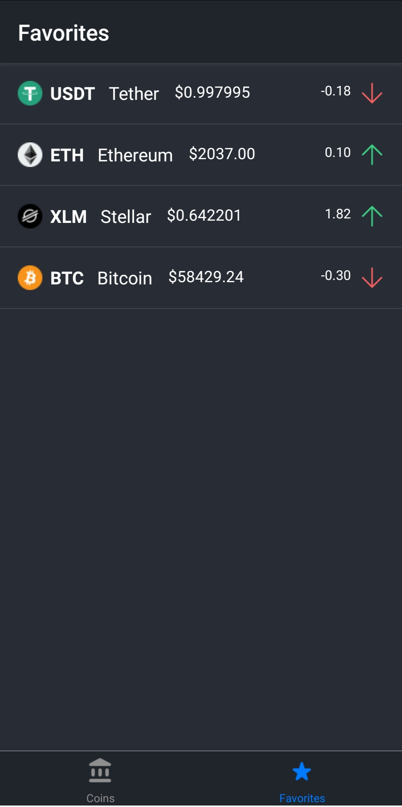

# crypto-tracker

App developed using React Native, to show information about cryptocurrencies. 
It also allows you to select the cryptocurrency you want as a favorite and you can see the prices in the Paraguayan currency.

API used for coins data [Coinlore API](https://www.coinlore.com/).

API used for convert prices to Paraguayan currency [http://dolar.melizeche.com/api/1.0/](http://dolar.melizeche.com/api/1.0/) created by [melizeche](https://github.com/melizeche)

### RUN
Clone the repo !
```
cd crypto-tracker-react-native

npm install

npm start

--Run on device or emulator
npm run android
npm run ios

```

<table cellspacing="0" cellpadding="0">
  <tr>
    <td valign="top">
          
    </td>
    <td valign="top">
        
    </td>
    <td>
      
    </td>
  </tr>
</table>

